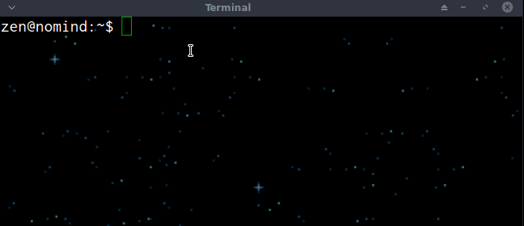

timec - the count up timer for terminals
----------------------------------------

```
Usage: timec [option]
(starts a time up counter on terminal)

[option] list:
--label "Text"		Labels the timer with "Text"		
--help			Shows this message
--version		Shows current version
```

Screenshot
----------

This is how to use it...




